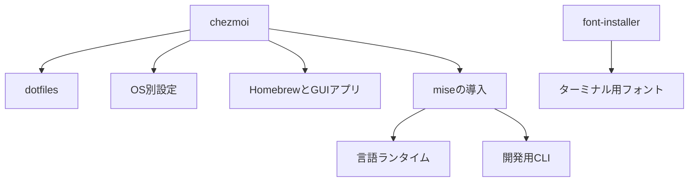

# AGENTS.md

## 目的

このリポジトリは、chezmoiを使って
複数環境のdotfilesを管理します。

対象環境は次のとおりです。

- macOS
- Ubuntu
- WSL2
- Dev Container

変更では、既存環境を壊さず、
再適用可能な状態を維持してください。

## 最初に確認するファイル

作業前に、次のファイルを
確認してください。

1. `AGENTS.md`
2. `README.md`
3. 対象ファイルと関連テンプレート
4. `git status --short`

`docs/testing`や`docs/architecture`がある場合は、
関連資料も確認してください。

指示がない限り、次を
読み込まないでください。

- `secrets/`
- `.env`
- 秘密鍵
- 暗号化前の秘密情報

## 管理ツールの責務

chezmoiとmiseは、次の責務で共存します。



chezmoiは、ホームディレクトリと
OS固有設定を管理します。

miseは、言語ランタイムと
ポータブルな開発用CLIを管理します。

Brewfileは、GUIアプリと
OS依存パッケージを管理します。

フォントの導入と更新は、
`tom-miy/font-installer`で管理します。

このリポジトリからフォントを
直接ダウンロードしないでください。

## 設定ファイルの配置

設定ファイルの正本は、可能な限り
`~/.config`配下に配置します。

ホーム直下に必要なファイルは、
chezmoi管理のシンボリックリンクにします。

例は次のとおりです。

```text
~/.zshrc -> ~/.config/zsh/.zshrc
```

新しい設定をホーム直下へコピーする前に、
XDG互換の配置を検討してください。

Zsh設定は次の責務で分割します。

```text
~/.config/zsh/.zshrc: loader
~/.config/zsh/conf.d: 設定
~/.config/zsh/functions: 自作関数
~/.config/sheldon: 外部プラグイン
```

自作関数を`.zshrc`へ
直接追加しないでください。
外部プラグインの処理はSheldonへ置きます。

既存の配置を変更する場合は、
先にロールバック方法を説明してください。

## 端末固有パラメータ

氏名やメールなどの端末固有値は、
リポジトリへ直接保存しません。

値は`home/.chezmoi.toml.tmpl`で入力し、
端末固有のchezmoi設定へ保存します。

テンプレートでは、次の値を使用します。

- `personal_name`
- `personal_email`
- `personal_github_user`
- `business_enabled`
- `business_name`
- `business_email`
- `business_github_user`
- `generate_ssh_keys`
- `sign_git_commits`

仮の氏名やメールを設定しないでください。
不明な値は、ユーザーへ確認してください。

パラメータ追加時は、次も
更新してください。

1. `home/.chezmoi.toml.tmpl`
2. 使用するテンプレート
3. `README.md`
4. business有効・無効のテスト

## Gitとコミット署名

コミット署名はSSH方式を使用します。
GPG署名を追加しないでください。

認証鍵と署名鍵は分離します。

```text
github_personal_ed25519
github_personal_signing_ed25519
github_business_ed25519
github_business_signing_ed25519
```

既存の秘密鍵を上書き、移動、
削除しないでください。
鍵ローテーションは明示的な
作業に分離します。

Git共通設定には署名方式だけを置きます。
署名鍵はpersonalとbusinessの
条件付き設定で選択します。

署名設定を変更した場合は、
次の選択結果を確認してください。

```bash
git config --show-origin --get user.name
git config --show-origin --get user.email
git config --show-origin --get user.signingkey
git config --show-origin --get commit.gpgsign
```

personalとbusinessの一時リポジトリで、
それぞれを検証してください。

GitHubへの公開鍵登録は、
`github-ssh-keys`mise taskで行います。

このタスクは外部状態を変更します。
ユーザーの明示操作なしに
実行しないでください。

鍵の削除やローテーションを、
タスクへ自動追加しないでください。

## chezmoiスクリプト

スクリプトは再実行可能にしてください。

次の規則を優先します。

- `set -eu`を使用する
- 既存ファイルを上書きしない
- 追記前に重複を確認する
- dry-runで変更しない
- ホームパスをハードコードしない
- 個人情報や秘密情報をログへ出さない
- 実行順をファイル名で明示する

設定配置後に必要な処理には、
`run_*_after_*`を使用してください。

宣言的なchezmoi管理で表現できる場合は、
シェルから設定ファイルを
直接変更しないでください。

## miseとBrewfile

同じツールをmiseとBrewfileの両方へ
追加しないでください。

原則は次のとおりです。

| 対象 | 管理元 |
|---|---|
| Node、Python、Go、Rust | mise |
| ポータブルCLI | mise |
| GUIアプリ | Brewfile |
| OSライブラリ | Brewfile |
| ターミナル用フォント | font-installer |

所有権を移動するときは、
先に新しい管理元で
導入できることを確認してください。

パッケージを自動削除するコマンドは、
ユーザーの明示的な承認なしに
実行しないでください。

## 変更方針

変更はsmall-batchを優先します。

基本は、1コミットにつき1責務です。

不要なリファクタリングや、
未使用の抽象化を追加しないでください。

大規模変更では、実装前に
コミット分割案を提示してください。

既存のREADME、設定、コメントと
動作を整合させてください。

TODOは根拠なく削除しないでください。

## Markdown

Markdownでは、目的とゴールを明示します。

構造化とMermaidを必要に応じて使用します。

原則として、1行を60文字以下にします。

英語版の文書を新規作成する場合は、
対応する日本語版も作成してください。

日本語版には、中途半端な英語説明を
混在させないでください。

## 検証

変更に応じて、次を実行してください。

```bash
git diff --check
chezmoi diff
chezmoi apply --dry-run --verbose
```

テンプレートへ端末固有値を
追加した場合は、
架空データを使って検証してください。

実在する氏名、メール、秘密情報を
テスト出力へ含めないでください。

Zsh設定を変更した場合は、次を実行します。

```bash
zsh -n ~/.config/zsh/.zshrc
zsh -lic 'echo shell startup succeeded'
```

シェルスクリプトは、対象シェルの
構文検査を実行してください。

```bash
sh -n path/to/script.sh
```

mise設定は、次で確認します。

```bash
mise fmt --check
mise install --dry-run
```

Brewfileでは、削除を伴わない確認を
優先してください。

```bash
brew bundle check --file="$HOME/.Brewfile"
```

## 適用と破壊的変更

調査や検証では、実ホームへ適用しません。

`chezmoi apply`を実行する前に、
差分と影響対象を
ユーザーへ示してください。

次の操作前には、影響範囲と
ロールバック方法を説明してください。

- SSH鍵の変更
- Git署名方式の変更
- ファイルからリンクへの変更
- パッケージの削除
- OS設定の変更

秘密鍵、既存設定、パッケージを
無断で削除しないでください。
