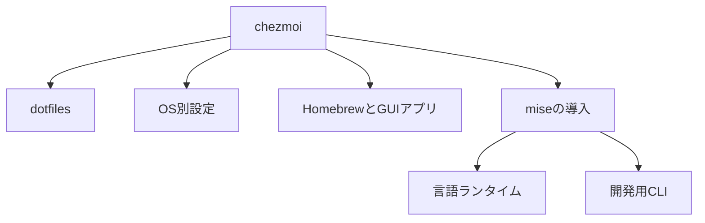

# Dotfiles

このリポジトリは私の dotfiles を管理するためのものです。[chezmoi](https://www.chezmoi.io/) を使用して、以下の環境間で設定を同期します。
 * macOs
 * Ubuntu
 * Dev Container
 * WSL2

## セットアップ

### 1. chezmoiのインストール

#### macOS

```bash
brew install chezmoi
```

```bash
xcode-select --install
sh -c "$(curl -fsLS get.chezmoi.io)" -- init --apply $GITHUB_USERNAME
```

```bash
xcode-select --install
sh -c "$(curl -fsLS get.chezmoi.io)" -- init --apply git@github.com:$GITHUB_USERNAME/dotfiles.git
```
#### Ubuntu

```bash
snap install chezmoi --classic
```

#### その他のプラットフォーム
[公式インストールガイド](https://www.chezmoi.io/install/)を参照してください。

### 2. dotfilesの初期化

```bash
chezmoi init https://github.com/YOUR_USERNAME/dotfiles.git
```

### 3. dotfilesの適用

```bash
chezmoi apply
```

## 主な設定ファイル

- `~/.config/zsh/.zshrc` - Zshの設定
- `~/.config/git/config` - Gitの共通設定
- `~/.config/mise/config.toml` - 開発ツール
- `~/.config/sheldon/plugins.toml` - Zshプラグイン
- `~/.config/karabiner/karabiner.json` - Karabiner-Elements（USキーボードかな入力のWindows配列化）。設計とトラブルシュートは [docs/karabiner.md](docs/karabiner.md) を参照

`~/.zshrc`は次のファイルへの
シンボリックリンクです。

```text
~/.zshrc -> ~/.config/zsh/.zshrc
```

Zsh設定は責務ごとに分割します。

```text
~/.config/zsh/
├── .zshrc
├── conf.d/
│   ├── 00-environment.zsh
│   ├── 10-options.zsh
│   ├── 20-completion.zsh
│   └── 30-interactive.zsh
└── functions/
    ├── git.zsh
    ├── navigation.zsh
    └── platform.zsh
```

`.zshrc`は読み込み順だけを管理します。
自作関数は`functions`へ配置します。
外部プラグインはSheldonで管理します。

VS CodeやCursorでは、次のように
設定を開けます。

```bash
code ~/.config
```

chezmoiのソースへ変更を取り込む場合は、
対象ファイルを明示します。

```bash
chezmoi add ~/.config/zsh/.zshrc
```

## 管理ツールの役割

chezmoiとmiseは、次の役割で共存させます。



chezmoiはホームディレクトリと
OS設定を管理します。
miseは言語ランタイムと
開発用CLIを管理します。

Node、Python、Go、Rustはmiseで管理します。
GUIアプリとOS依存パッケージは
Brewfileで管理します。

ターミナル用フォントの導入と更新は、
[font-installer][font-installer]で管理します。
chezmoiからフォントを
直接ダウンロードしません。

WezTermでは`HackGen35 Console NF`を使用します。
StarshipやPowerlevel10kのアイコン表示にも、
Nerd Fonts対応フォントを使用します。

## 診断と静的検査

端末の状態は次で診断します。

```bash
mise run dotfiles-doctor
```

dotfilesソースは次で検査します。

```bash
mise run dotfiles-check
```

現在のGit identityを確認します。

```bash
mise run git-identity
git-whoami
```

Git SSH署名設定を確認します。

```bash
mise run git-signing-check
```

静的検査には次のツールを使用します。

- ShellCheck
- actionlint
- mise fmt
- Zshの構文検査

Gitの差分表示にはdeltaを使用します。

## 端末固有パラメータ

次の値はリポジトリへ保存しません。

- 個人用の氏名とGitメール
- 個人用のGitHubユーザー名
- 仕事用の氏名とGitメール
- 仕事用のGitHubユーザー名
- SSH鍵生成とコミット署名の有効状態

初回の`chezmoi init`で値を入力します。
値は端末固有のchezmoi設定へ保存されます。

設定テンプレートを更新した場合や、
値を変更する場合は、
次のコマンドを実行します。

```bash
chezmoi init --prompt
chezmoi data
chezmoi diff
chezmoi apply
```

`chezmoi data`の出力には
個人情報が含まれます。
ログやIssueへ貼り付けないでください。

## Gitアカウントとコミット署名

Gitの共通設定は次のファイルです。

```text
~/.config/git/config
```

リポジトリのremote URLに応じて、
次を切り替えます。

- Gitの氏名
- Gitのメール
- SSHコミット署名鍵

現在のリポジトリで選択された値は、
次で確認します。

```bash
git config --show-origin --get user.name
git config --show-origin --get user.email
git config --show-origin --get user.signingkey
git config --show-origin --get commit.gpgsign
```

署名結果は次のコマンドで確認します。

```bash
git log --show-signature -1
```

## SSH鍵の生成と更新

SSH鍵生成を有効にした場合も、
既存鍵は上書きしません。
新しい鍵では`ssh-keygen`が
パスフレーズを確認します。

メール変更だけでは鍵を再生成しません。
公開鍵末尾のメールは
識別用コメントだからです。

鍵をローテーションする場合は、
先に既存鍵を退避します。
GitHub側へ新しい公開鍵を登録してから
切り替えます。

自動生成される鍵のパスは次のとおりです。

```text
~/.ssh/github_personal_ed25519
~/.ssh/github_personal_signing_ed25519
~/.ssh/github_business_ed25519
~/.ssh/github_business_signing_ed25519
```

鍵を削除する処理は、
このリポジトリに含めません。

## GitHubへのSSH鍵登録

ローカルの鍵生成はchezmoiが担当します。
GitHubへの公開鍵登録は、
明示的なmise taskで実行します。


最初にWeb認証を実行します。

```bash
mise run github-ssh-keys -- auth personal
```

仕事用アカウントを使用する場合は、
次も実行します。

```bash
mise run github-ssh-keys -- auth business
```

認証時は`gh auth login --web`を使用します。
`--skip-ssh-key`により、ghによる
意図しない鍵生成を抑止します。

認証鍵と署名鍵の管理に必要な
GitHub権限も認証時に要求します。

認証鍵と署名鍵を登録します。

```bash
mise run github-ssh-keys -- register personal
mise run github-ssh-keys -- register business
```

個別に登録することもできます。

```bash
mise run github-ssh-keys -- register-auth personal
mise run github-ssh-keys -- register-signing personal
```

登録済みの鍵は次で確認します。

```bash
mise run github-ssh-keys -- list personal
mise run github-ssh-keys -- status
```

タスクは登録対象のGitHubアカウントへ
切り替えてから処理します。

登録前にGitHub側の公開鍵を確認します。
同じ鍵が登録済みの場合は
追加を省略します。

鍵の削除とローテーションは、
誤操作を避けるため自動化しません。

## ロールバック

Zsh設定を戻す場合は、
リンクを適用する変更を戻し、
旧`dot_zshrc.tmpl`を復元してから適用します。

```bash
chezmoi diff
chezmoi apply
```

miseからBrewfileへ戻す場合は、対象formulaを
Brewfileへ戻してから`brew bundle`を実行します。

既存ツールを自動削除する処理は
実行しません。

## macOS用ソフトウェア

- [Clipy](https://github.com/Clipy/Clipy) - クリップボード履歴管理ツール(`Brewfile`の`cask "clipy"`でインストールされます)

## プラットフォーム固有の設定

プラットフォーム固有の設定は `.chezmoi.toml.tmpl` で管理されています。

## メンテナンス

### 設定の更新

```bash
chezmoi update
```


### 変更の適用

```bash
chezmoi apply
```


### 差分の確認

```bash
chezmoi diff
```

### installコマンドファイル生成

```bash
chezmoi generate install.sh > install.sh
chmod a+x install.sh
```

### `~/.config/git/config`設定例


```bash
~/.config/git/
├── config                # メインの設定
├── personal/            
│   └── config           # 個人用の設定
├── business/
│   └── config           # 仕事用の設定
├── ignore               # グローバルな.gitignore
└── attributes          # gitattributes
```

```conf
[core]
    editor = cursor
    excludesfile = ~/.config/git/ignore

[init]
    defaultBranch = main

[ghq]
    root = ~/ghq/misc
# 条件付きインクルード
[includeIf "gitdir:~/personal/"]
    path = ~/.config/git/personal/config

[includeIf "gitdir:~/work/"]
    path = ~/.config/git/business/config
```

### dev container設定例

customizationsはcursorの場合もvscodeで大丈夫なはず
```json
{
    "name": "Your Dev Container",
    "customizations": {
        "vscode": {
            "settings": {
                "dotfiles.repository": "${localEnv:HOME}/.local/share/chezmoi",
                "dotfiles.targetPath": "~/.local/share/chezmoi",
                "dotfiles.installCommand": "chezmoi init --apply"
            }
        }
    },
    "features": {
        "ghcr.io/meaningful-ooo/devcontainer-features/chezmoi:1": {}
    },
    // ローカルのdotfilesディレクトリをマウント
    "mounts": [
        "source=${localEnv:HOME}/.local/share/chezmoi,target=/home/vscode/.local/share/chezmoi,type=bind"
    ]
}
```

### Cursor用devcontainer dotfiles設定

Cursorでdevcontainerを使用する場合、以下の設定を `~/.cursor` に追加してdotfilesを自動で同期できます：

#### 1. `~/.cursor/devcontainer.json` にdotfiles設定を追加

```json
{
    "dotfiles": {
        "repository": "tom-miy/dotfiles-devcontainer",
        "installCommand": "./install.sh"
    }
}
```

#### 2. プロジェクト固有の `.devcontainer/devcontainer.json` 設定

```json
{
    "name": "Your Dev Container",
    "customizations": {
        "vscode": {
            "settings": {
                "dotfiles.repository": "tom-miy/dotfiles-devcontainer",
                "dotfiles.installCommand": "./install.sh"
            }
        }
    }
}
```

#### 3. ローカルdotfilesディレクトリを直接マウントする場合

```json
{
    "name": "Your Dev Container",
    "mounts": [
        "source=${localEnv:HOME}/.local/share/chezmoi,target=/workspaces/.dotfiles,type=bind"
    ],
    "postCreateCommand": "cd /workspaces/.dotfiles && ./install.sh"
}
```
### 参考
[ghqとSSHの設定で複数のGitアカウントを効率よく管理する方法](https://www.fourier.jp/blog/ghq-ssh-multi-git-account-management?utm_source=pocket_shared)
[Powerlevel10kのフォント](https://qiita.com/831kirimi/items/582e0abc26dbd7776d9b)
[zshの補完を強化するTips](https://qiita.com/syui/items/ed2d36698a5cc314557d)

[font-installer]: https://github.com/tom-miy/font-installer
